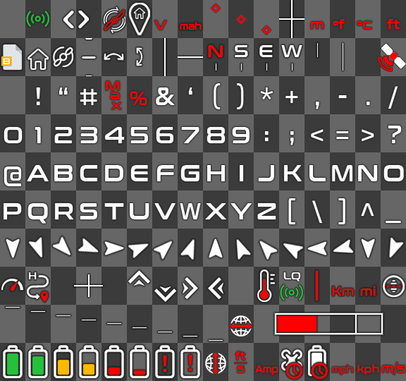

  
  
  
   
   
  
   
   
  
  
  

     
    <a>This is a font for </a><a href="https://github.com/fpv-wtf/msp-osd">WTFOS MSP-OSD</a><a> with a nice design using colorful icons!</a>
     
    <a>Created with the </a><a href="https://www.dafont.com/fr/conthrax.font?text=EVilm1%27s+Font">Conthrax</a><a> font</a>
      
    <a>ℹ️ Only Betaflight is supported.</a>
      
    <a>A video example (DJI HUD has been added on it for the example):</a>
  

https://user-images.githubusercontent.com/51506790/208981180-be9528f5-7118-47d3-8a71-b43425f159c6.mp4

## Installation

1. Download the latest release from the [releases page](https://github.com/EVilm1/EVilm1-OSD-Font/releases).
2. Unzip all `.bin` files to the root of your goggle's SD card.
3. Fly!

If you want more info and instructions on how to modify the osd I have created a complete doc here : [EVilm1/WIKI-HACK-DJI-OSD](https://github.com/EVilm1/WIKI-HACK-DJI-OSD) 
If you liked it, you can buy me a coffee 😉 : https://www.buymeacoffee.com/evilm1
